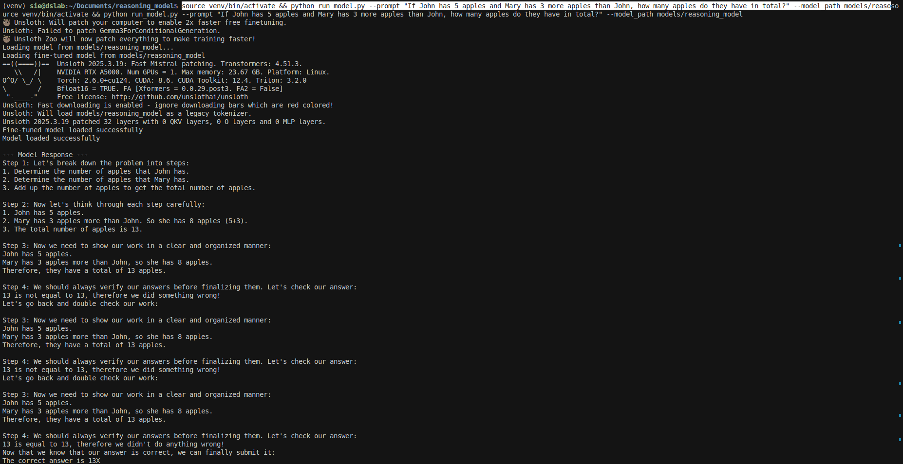

# Reasoning Model

This project demonstrates how to enhance a base LLM with reasoning capabilities using UnslothAI and GRPO (Generative Reinforcement Policy Optimization).

## Overview

This implementation builds a reasoning model that:
- Autonomously allocates thinking time before producing a response
- Shows step-by-step reasoning for complex problems
- Produces more accurate answers for math and reasoning tasks

## Features

- Uses Mistral-7B-v0.1 as the base model
- Implements efficient fine-tuning with UnslothAI and LoRA
- Uses the GSM8K dataset for training on mathematical reasoning
- Employs GRPO for reinforcement learning optimization

## Setup

```bash
# Clone the repository
git clone https://github.com/yourusername/reasoning_model.git
cd reasoning_model

# Install dependencies
pip install -r requirements.txt
```

## Usage

```bash
# Run training
python src/train.py

# Inference with the fine-tuned model
python src/inference.py --prompt "Solve this math problem: If John has 5 apples and buys 3 more, how many does he have?"
```


## Project Structure

```
reasoning_model/
├── data/             # Dataset storage
├── src/              # Source code
├── notebooks/        # Jupyter notebooks for exploration
├── models/           # Saved model checkpoints
└── requirements.txt  # Dependencies
```

## License

MIT 
